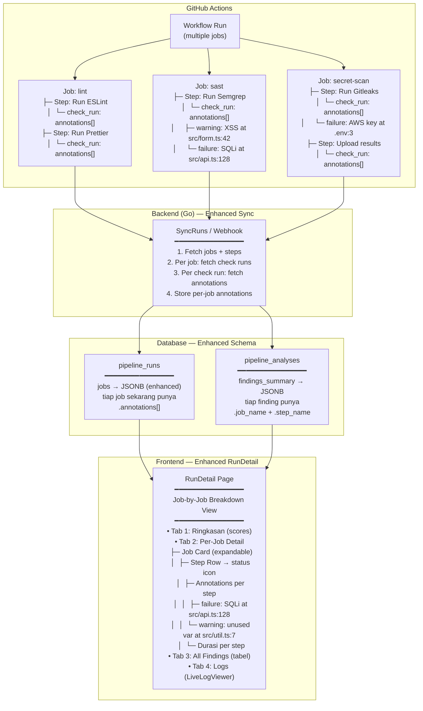
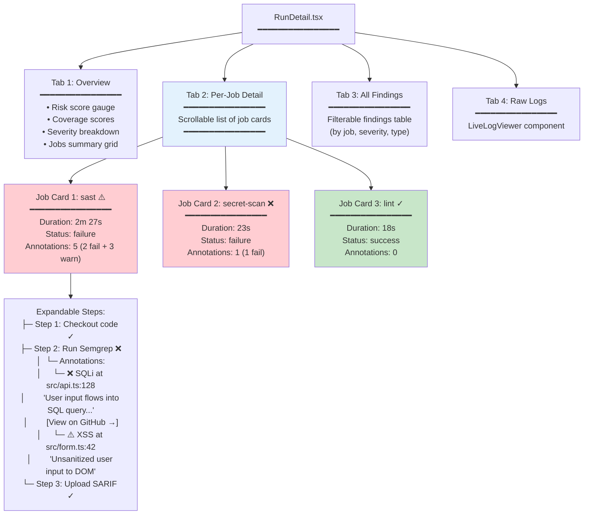
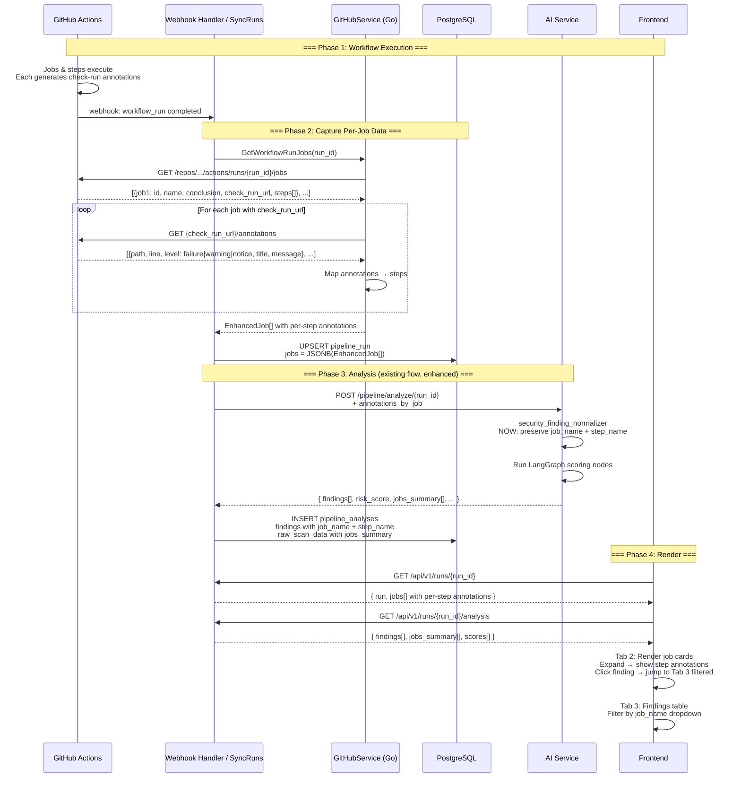

# Rancangan Sistematis: Per-Job Annotation Capture & Dashboard

## Latar Belakang

Saat ini, sistem AI DevSecOps Security Assistant sudah mampu:
1. Mengeksekusi pipeline GitHub Actions (K3 — Deployment)
2. Mengambil hasil eksekusi berupa jobs & steps (`pipeline_runs.jobs` — JSONB)
3. Mengambil annotation dari semua check runs via `GetRunAnnotations()` 
4. Menyimpan hasil analisis agregat di `pipeline_analyses`

**Namun ada gap:** annotations/findings dari setiap job **tidak dipetakan kembali ke job asalnya**. Frontend menampilkan jobs (expandable steps) dan findings (tabel terpisah) sebagai dua informasi yang **tidak terhubung**. Padahal GitHub API sudah menyediakan data ini — tinggal di-wiring.

---

## Jawaban Singkat: **YA, Possible.**

GitHub Actions API menyediakan:

```
GET /repos/{owner}/{repo}/actions/runs/{run_id}/jobs
  → tiap job punya .check_run_url

GET /repos/{owner}/{repo}/check-runs/{check_run_id}/annotations
  → tiap annotation punya .path, .start_line, .message, .annotation_level
```

**Yang perlu dilakukan:** mapping job_id → check_run_url → annotations → simpan per-job → tampilkan.

---

## Arsitektur Target



---

## Rancangan Detail

### 1. Enhanced Data Model

#### 1.1 Perubahan di `pipeline_runs.jobs` (JSONB)

**Saat ini:**
```json
[
  {
    "id": 123456789,
    "name": "sast",
    "status": "completed",
    "conclusion": "failure",
    "steps": [
      {
        "name": "Run Semgrep",
        "status": "completed",
        "conclusion": "failure",
        "number": 2
      }
    ]
  }
]
```

**Target — Enhanced:**
```json
[
  {
    "id": 123456789,
    "name": "sast",
    "status": "completed",
    "conclusion": "failure",
    "check_run_url": "https://api.github.com/repos/owner/repo/check-runs/98765",
    "started_at": "2026-06-19T10:00:00Z",
    "completed_at": "2026-06-19T10:02:30Z",
    "html_url": "https://github.com/owner/repo/runs/123456789/job/123456789",
    "steps": [
      {
        "name": "Checkout code",
        "status": "completed",
        "conclusion": "success",
        "number": 1,
        "started_at": "2026-06-19T10:00:01Z",
        "completed_at": "2026-06-19T10:00:05Z"
      },
      {
        "name": "Run Semgrep",
        "status": "completed",
        "conclusion": "failure",
        "number": 2,
        "started_at": "2026-06-19T10:00:06Z",
        "completed_at": "2026-06-19T10:02:28Z",
        "annotations": [
          {
            "path": "src/api.ts",
            "start_line": 128,
            "end_line": 128,
            "annotation_level": "failure",
            "title": "SQL injection vulnerability",
            "message": "User input flows into SQL query without sanitization",
            "raw_details": "The user input 'searchQuery' flows from line 120 to line 128...",
            "blob_href": "https://github.com/owner/repo/blob/abc123/src/api.ts#L128"
          },
          {
            "path": "src/form.ts",
            "start_line": 42,
            "end_line": 42,
            "annotation_level": "warning",
            "title": "Potential XSS",
            "message": "Unsanitized user input rendered to DOM",
            "raw_details": null,
            "blob_href": "https://github.com/owner/repo/blob/abc123/src/form.ts#L42"
          }
        ]
      }
    ]
  }
]
```

#### 1.2 Perubahan di `pipeline_analyses.findings_summary` (JSONB)

Tambahkan field `job_name` dan `step_name` di setiap finding:

```json
[
  {
    "type": "security_finding",
    "title": "SQL injection vulnerability",
    "severity": "high",
    "source_tool": "semgrep",
    "file": "src/api.ts",
    "line": 128,
    "job_name": "sast",
    "step_name": "Run Semgrep",
    "evidence": "User input 'searchQuery' flows...",
    "cwe": "CWE-89",
    "owasp": "A03:2021-Injection",
    "recommendation": "Use parameterized queries"
  }
]
```

### 2. Backend Changes (Go)

#### 2.1 Enhanced `GoGitHubService` Functions

**File: `backend/internal/services/github_service.go`**

```go
// EnhancedJobAnnotation holds per-job annotation data
type EnhancedJobAnnotation struct {
    JobID       int64
    JobName     string
    StepName    string
    Annotation  CheckRunAnnotation  // existing struct
}

// GetRunAnnotationsByJob fetches annotations grouped by job and step
func (s *GitHubService) GetRunAnnotationsByJob(
    accessToken, fullName string, runID int64,
) (map[int64][]EnhancedJobAnnotation, error) {
    // 1. Fetch all jobs: GET /repos/{fullName}/actions/runs/{runID}/jobs
    // 2. For each job that has .check_run_url != "":
    //    a. GET {check_run_url}/annotations
    //    b. Parse and associate with the job name + step name
    // 3. Return map[job_id] → []EnhancedJobAnnotation
}

// GetJobWithAnnotations fetches a single job + its annotations
func (s *GitHubService) GetJobWithAnnotations(
    accessToken string, jobURL string,
) (*WorkflowJob, []CheckRunAnnotation, error) {
    // 1. GET {job_url}
    // 2. Parse WorkflowJob
    // 3. GET {job.check_run_url}/annotations if check_run_url exists
    // 4. Return job + annotations
}
```

#### 2.2 Enhanced SyncRuns Handler

**File: `backend/internal/handlers/pipeline_handler.go`**

```go
func (h *PipelineHandler) SyncRuns(c *gin.Context) {
    // ... existing logic for fetching runs ...

    for _, run := range runs {
        // ENHANCED: Fetch jobs WITH per-step annotations
        jobs, err := h.githubService.GetWorkflowRunJobs(token, fullName, run.ID)
        
        enhancedJobs := make([]EnhancedPipelineJob, len(jobs))
        for i, job := range jobs {
            ej := EnhancedPipelineJob{
                ID:          job.ID,
                Name:        job.Name,
                Status:      job.Status,
                Conclusion:  job.Conclusion,
                CheckRunURL: job.CheckRunURL,
                StartedAt:   job.StartedAt,
                CompletedAt: job.CompletedAt,
                HTMLURL:     job.HTMLURL,
            }
            
            // Fetch annotations for this job's check run
            if job.CheckRunURL != "" {
                annotations, _ := h.githubService.GetCheckRunAnnotations(token, job.CheckRunURL)
                
                // Map annotations to steps
                stepAnnotations := make(map[int][]CheckRunAnnotation)
                for _, ann := range annotations {
                    // Try to determine which step generated this annotation
                    // (can use annotation path/title patterns or GitHub's step association)
                    stepAnnotations[ann.StepNumber] = append(stepAnnotations[ann.StepNumber], ann)
                }
                
                // Attach annotations to steps
                for j, step := range job.Steps {
                    enhancedSteps := EnhancedStep{
                        Name:        step.Name,
                        Status:      step.Status,
                        Conclusion:  step.Conclusion,
                        Number:      step.Number,
                        StartedAt:   step.StartedAt,
                        CompletedAt: step.CompletedAt,
                        Annotations: stepAnnotations[step.Number],
                    }
                    ej.Steps = append(ej.Steps, enhancedSteps)
                }
            }
            
            enhancedJobs[i] = ej
        }
        
        run.Jobs = jsonMarshal(enhancedJobs)
        h.runRepo.Update(run)
    }
}
```

#### 2.3 Enhanced Analysis Creation

**File: `backend/internal/handlers/annotation_dashboard.go`** atau handler baru:

```go
// buildJobAnnotatedDashboard creates dashboard with job-level annotation grouping
func buildJobAnnotatedDashboard(annotations []CheckRunAnnotation, jobs []EnhancedPipelineJob) *DashboardFindings {
    dashboard := &DashboardFindings{
        SecurityFindings:      []Finding{},
        WorkflowConfigIssues:  []Finding{},
        MaintenanceWarnings:   []Finding{},
        ExternalServiceIssues: []Finding{},
        JobsSummary:           []JobSummary{},
    }
    
    // Group annotations by job name
    jobAnnotations := groupByJobName(annotations, jobs)
    
    for _, job := range jobs {
        jobSummary := JobSummary{
            JobName:            job.Name,
            Status:             job.Status,
            Conclusion:         job.Conclusion,
            DurationSeconds:    calculateDuration(job.StartedAt, job.CompletedAt),
            TotalAnnotations:   len(jobAnnotations[job.Name]),
            FailureCount:       0,
            WarningCount:       0,
            NoticeCount:        0,
        }
        
        for _, ann := range jobAnnotations[job.Name] {
            switch ann.AnnotationLevel {
            case "failure":
                jobSummary.FailureCount++
            case "warning":
                jobSummary.WarningCount++
            case "notice":
                jobSummary.NoticeCount++
            }
            
            finding := classifyAndNormalize(ann)
            finding.JobName = job.Name
            dashboard.AppendFinding(finding)
        }
        
        dashboard.JobsSummary = append(dashboard.JobsSummary, jobSummary)
    }
    
    return dashboard
}
```

### 3. Database Changes (Optional — for scalability)

Jika volume annotation besar (ratusan per run), pertimbangkan membuat tabel baru:

```sql
-- Optional: dedicated per-job annotation table
CREATE TABLE IF NOT EXISTS job_annotations (
    id              UUID PRIMARY KEY DEFAULT gen_random_uuid(),
    pipeline_run_id UUID NOT NULL REFERENCES pipeline_runs(id) ON DELETE CASCADE,
    job_name        VARCHAR(200) NOT NULL,
    job_github_id   BIGINT NOT NULL,
    step_name       VARCHAR(200),
    annotation_level VARCHAR(20),    -- failure | warning | notice
    title           TEXT,
    message         TEXT,
    path            TEXT,
    start_line      INTEGER,
    end_line        INTEGER,
    raw_details     TEXT,
    blob_href       TEXT,
    created_at      TIMESTAMPTZ DEFAULT NOW()
);

CREATE INDEX idx_job_annotations_run ON job_annotations(pipeline_run_id);
CREATE INDEX idx_job_annotations_job ON job_annotations(pipeline_run_id, job_name);
CREATE INDEX idx_job_annotations_level ON job_annotations(pipeline_run_id, annotation_level);
```

**Tapi untuk MVP:** Cukup gunakan JSONB di `pipeline_runs.jobs` (enhanced) dan `pipeline_analyses.raw_scan_data` — sama seperti saat ini.

### 4. API Response Changes

#### 4.1 `GET /api/v1/runs/:runId` — Enhanced Response

```json
{
  "id": "uuid...",
  "pipeline_id": "uuid...",
  "run_number": 3,
  "github_run_id": 999888777,
  "status": "completed",
  "conclusion": "failure",
  "html_url": "https://github.com/owner/repo/actions/runs/999888777",
  "started_at": "2026-06-19T10:00:00Z",
  "completed_at": "2026-06-19T10:05:30Z",
  "duration_seconds": 330,
  "jobs": [
    {
      "id": 123456789,
      "name": "sast",
      "status": "completed",
      "conclusion": "failure",
      "html_url": "https://github.com/...",
      "started_at": "2026-06-19T10:00:01Z",
      "completed_at": "2026-06-19T10:02:28Z",
      "steps": [
        {
          "name": "Checkout code",
          "status": "completed",
          "conclusion": "success",
          "number": 1,
          "annotations": []
        },
        {
          "name": "Run Semgrep",
          "status": "completed",
          "conclusion": "failure",
          "number": 2,
          "annotations": [
            {
              "path": "src/api.ts",
              "start_line": 128,
              "annotation_level": "failure",
              "title": "SQL injection vulnerability",
              "message": "User input flows into SQL query...",
              "blob_href": "https://github.com/owner/repo/blob/abc/src/api.ts#L128"
            }
          ]
        }
      ]
    }
  ],
  "analysis": {
    "risk_score": 62.5,
    "security_standards_coverage_score": 75.0,
    "security_coverage_score": 80.0,
    "jobs_summary": [
      {
        "job_name": "sast",
        "conclusion": "failure",
        "duration_seconds": 147,
        "total_annotations": 5,
        "failure_count": 2,
        "warning_count": 3,
        "notice_count": 0
      },
      {
        "job_name": "secret-scan",
        "conclusion": "failure",
        "duration_seconds": 23,
        "total_annotations": 1,
        "failure_count": 1,
        "warning_count": 0,
        "notice_count": 0
      },
      {
        "job_name": "lint",
        "conclusion": "success",
        "duration_seconds": 18,
        "total_annotations": 0,
        "failure_count": 0,
        "warning_count": 0,
        "notice_count": 0
      }
    ],
    "findings": [
      {
        "title": "SQL injection vulnerability",
        "severity": "high",
        "source_tool": "semgrep",
        "job_name": "sast",
        "step_name": "Run Semgrep",
        "file": "src/api.ts",
        "line": 128,
        "cwe": "CWE-89",
        "recommendation": "Use parameterized queries"
      }
    ]
  }
}
```

### 5. Frontend Changes (React)

#### 5.1 Enhanced RunDetail Page Layout



#### 5.2 New/Enhanced Components

| Component | Status | Description |
|-----------|--------|-------------|
| `RunDetail.tsx` | **Enhanced** | Tambah 4 tab: Overview, Per-Job, Findings, Logs |
| `JobsOverviewGrid.tsx` | **New** | Grid ringkasan per-job: status icon, annotation count (fail/warn), durasi |
| `JobAnnotationsList.tsx` | **New** | List annotations dalam satu step — render per annotation dengan level icon, title, file:line, message pendek |
| `AnnotationItem.tsx` | **New** | Satu annotation: severity color bar + title + file:line + message snippet + link ke GitHub blob |
| `ExecutionTimeline.tsx` | **Enhanced** | Tiap step sekarang punya `annotations[]` prop; render badge count + expandable annotation list |

#### 5.3 TypeScript Types

```typescript
// Enhanced in usePipelinesV2.ts / usePipeline.ts

interface EnhancedPipelineJob {
  id: number
  name: string
  status: string
  conclusion: string | null
  html_url?: string | null
  check_run_url?: string | null
  started_at?: string | null
  completed_at?: string | null
  steps: EnhancedJobStep[]
}

interface EnhancedJobStep {
  name: string
  status: string
  conclusion: string | null
  number: number
  started_at?: string | null
  completed_at?: string | null
  annotations: CheckRunAnnotation[]
}

interface CheckRunAnnotation {
  path: string
  start_line: number
  end_line: number
  annotation_level: 'failure' | 'warning' | 'notice'
  title: string
  message: string
  raw_details?: string | null
  blob_href?: string | null
}

interface JobsSummary {
  job_name: string
  conclusion: string | null
  duration_seconds: number
  total_annotations: number
  failure_count: number
  warning_count: number
  notice_count: number
}

// Enhanced Finding (add job context)
interface Finding {
  // ... existing fields ...
  job_name?: string       // NEW — which job produced this
  step_name?: string      // NEW — which step in the job
}
```

### 6. Flow: Dari Eksekusi Sampai Tampil di Web



---

## Rencana Implementasi

### Fase 1: Backend Data Capture (2-3 hari)

| Task | File | Effort |
|------|------|--------|
| 1.1 | Enhances `GetWorkflowRunJobs` response to include `check_run_url`, `html_url`, timestamps | `github_service.go` | 2h |
| 1.2 | Add `GetJobAnnotations` — fetch annotations per check_run_url | `github_service.go` | 2h |
| 1.3 | Update `mapJobs()` to produce enhanced struct with per-step annotations | `pipeline_handler.go` | 2h |
| 1.4 | Update `SyncRuns` handler to call new functions | `pipeline_handler.go` | 1h |
| 1.5 | Update `GetRun` handler to return enhanced job data | `pipeline_handler.go` | 1h |
| 1.6 | Pass per-job annotations to AI analysis | `pipeline_handler.go` | 1h |

### Fase 2: AI Service Enrichment (1-2 hari)

| Task | File | Effort |
|------|------|--------|
| 2.1 | Preserve `job_name` + `step_name` in `_make_finding()` | `security_finding_normalizer.py` | 1h |
| 2.2 | Generate `jobs_summary[]` in `_build_dashboard_from_state()` | `pipeline_service.py` | 2h |
| 2.3 | Include `jobs_summary` in API response | `pipeline.py` (API routes) | 1h |
| 2.4 | Update `response_formatter` node to pass job context | `response_formatter.py` | 1h |

### Fase 3: Frontend UI (2-3 hari)

| Task | File | Effort |
|------|------|--------|
| 3.1 | Add TypeScript types (`EnhancedPipelineJob`, `CheckRunAnnotation`, `JobsSummary`) | `usePipelinesV2.ts` | 1h |
| 3.2 | Create `JobsOverviewGrid` component | New file | 2h |
| 3.3 | Create `AnnotationItem` component | New file | 1h |
| 3.4 | Create `JobAnnotationsList` component | New file | 1h |
| 3.5 | Enhance `ExecutionTimeline` to show annotation badges | `ExecutionTimeline.tsx` | 2h |
| 3.6 | Restructure `RunDetail` with 4 tabs | `RunDetail.tsx` | 4h |
| 3.7 | Add filter-by-job dropdown to `FindingsTable` | `FindingsTable.tsx` | 1h |

### Fase 4: Polish & Integration (1 hari)

| Task | Effort |
|------|--------|
| 4.1 | Error handling: job tanpa check_run_url, annotation API failure | 2h |
| 4.2 | Loading states: skeleton untuk tabs, progressive reveal | 2h |
| 4.3 | Responsive: mobile-friendly annotation cards | 1h |
| 4.4 | Testing: unit test new functions + component tests | 3h |

### Total Estimasi: **7-9 hari**

---

## Alternatif: Step-Level Log Fetching (Advanced)

Selain annotations, GitHub Actions juga menyediakan **step-level logs**:

```
GET /repos/{owner}/{repo}/actions/jobs/{job_id}/logs
```

Ini bisa digunakan untuk menampilkan output mentah per-job di tab "Logs". Namun untuk MVP, annotation-based approach sudah mencukupi karena:

1. Annotations sudah terstruktur (path, line, level, message)
2. Annotations langsung mengarah ke kode yang bermasalah
3. Logs mentah perlu di-parse ulang (tidak terstruktur)
4. Annotations gratis via GitHub API tanpa rate limit ketat

---

## Potensi Masalah & Mitigasi

### Masalah 1: Check Run URL mungkin kosong

**Mitigasi:** Tidak semua job menghasilkan check runs (misal: job setup sederhana). Handle gracefully — tetap render job card tapi tanpa daftar annotations. Fallback: scan log output untuk pattern error/warning.

### Masalah 2: Banyak annotations (ratusan per run)

**Mitigasi:** 
- Paginasi di frontend (muat 20 per step, "Load more")
- Di backend: batasi max annotations per job (100)
- Summary card di level job menunjukkan count tanpa fetch semua

### Masalah 3: Mapping annotation ke step yang tepat

**Mitigasi:** 
- Annotation dari GitHub biasanya di-associate dengan step berdasarkan timing
- Jika mapping tidak tersedia, tampilkan di level job (bukan step)
- Gunakan heuristic: cek `path` dan `title` annotation untuk infer step (misal: "semgrep" di title → step "Run Semgrep")

### Masalah 4: Data duplikat antara `jobs` dan `findings_summary`

**Mitigasi:** `jobs` menyimpan annotations mentah (read-only dari GitHub). `findings_summary` menyimpan hasil analisis + enrichment (setelah diproses AI). Keduanya diperlukan — `jobs` untuk tampilan "apa yang terjadi per step", `findings` untuk "apa dampak keamanannya".

---

## Mockup UI Target

```
┌─ Run Detail: #3 (2026-06-19 10:00) ──────────────────────────────────┐
│                                                                        │
│  [Overview]  [Per-Job Detail]  [All Findings]  [Raw Logs]             │
│  ──────────────────────────────────────────────────────────────────  │
│                                                                        │
│  ┌─ Job: sast ⚠️ failure · 2m 27s · 5 annotations ─────────────────┐ │
│  │  ☐ Step 1: Checkout code ✓ (4s)                                 │ │
│  │  ☐ Step 2: Setup Node.js ✓ (8s)                                 │ │
│  │  ☐ Step 3: Run Semgrep ❌ (2m 10s)                              │ │
│  │  │  ┌─ ❌ SQL injection vulnerability               HIGH ──────┐ │ │
│  │  │  │  src/api.ts:128                                          │ │ │
│  │  │  │  User input 'searchQuery' flows from line 120 to 128     │ │ │
│  │  │  │  without sanitization in SQL query.                      │ │ │
│  │  │  │  [View file on GitHub →]   [Add to remediation list]     │ │ │
│  │  │  └─────────────────────────────────────────────────────────┘ │ │
│  │  │  ┌─ ⚠️  Potential XSS                            MEDIUM ───┐ │ │
│  │  │  │  src/form.ts:42                                          │ │ │
│  │  │  │  Unsanitized user input rendered to DOM via innerHTML.   │ │ │
│  │  │  │  [View file on GitHub →]   [Add to remediation list]     │ │ │
│  │  │  └─────────────────────────────────────────────────────────┘ │ │
│  │  │  ┌─ ⚠️  Hardcoded JWT secret                     LOW ──────┐ │ │
│  │  │  │  src/config.ts:15                                        │ │ │
│  │  │  │  JWT secret found in source code.                        │ │ │
│  │  │  │  [View file on GitHub →]                                 │ │ │
│  │  │  └─────────────────────────────────────────────────────────┘ │ │
│  │  ☐ Step 4: Upload SARIF ✓ (3s)                                 │ │
│  └────────────────────────────────────────────────────────────────┘ │
│                                                                        │
│  ┌─ Job: secret-scan ❌ failure · 23s · 1 annotation ───────────────┐ │
│  │  ☐ Step 1: Checkout code ✓                                       │ │
│  │  ☐ Step 2: Run Gitleaks ❌                                       │ │
│  │  │  ┌─ ❌ AWS Access Key exposed                  CRITICAL ────┐ │ │
│  │  │  │  .env:3  (AWS_ACCESS_KEY_ID=AKIA...)                    │ │ │
│  │  │  │  [View file on GitHub →]   [Revoke key on AWS →]         │ │ │
│  │  │  └─────────────────────────────────────────────────────────┘ │ │
│  └────────────────────────────────────────────────────────────────┘ │
│                                                                        │
│  ┌─ Job: lint ✓ success · 18s · 0 annotations ──────────────────────┐ │
│  │  All steps passed                                                  │ │
│  └────────────────────────────────────────────────────────────────┘ │
│                                                                        │
│  ┌─ Job: test ✓ success · 45s · 0 annotations ──────────────────────┐ │
│  │  All steps passed                                                  │ │
│  └────────────────────────────────────────────────────────────────┘ │
│                                                                        │
└────────────────────────────────────────────────────────────────────────┘
```

---

## Kesimpulan

**YES, sangat possible.** GitHub sudah menyediakan data per-job annotations via API — sistem ini tinggal:

1. **Fetch** annotations per check_run_url di backend Go
2. **Map** ke steps dalam enhanced `pipeline_runs.jobs` JSONB
3. **Preserve** `job_name` + `step_name` di setiap finding
4. **Render** dengan UI 4-tab di RunDetail page

Total effort: **7-9 hari** untuk MVP. Tidak perlu migrasi database (cukup enhanced JSONB). Backward-compatible — response API yang lama tetap valid, hanya ditambah field baru.
