# Materi Utama PPT: Flow, Fitur, Demo, dan Rencana Pengujian Prototype

> **Acuan Naskah:** `struktur-v9.md` (struktur terbaru, 18 node compiled, 9 LLM calls)
> **Acuan Pengujian:** `struktur-v7.md` BAB 5 (Hasil dan Pembahasan)
> **Acuan Tools & Standar:** `README.md`, `ai-service/ARCHITECTURE.md`, `ISA Control.pdf`

---

## Ringkasan Flow 4 Tahapan (v9) — Mapping ke SDLC Waterfall

### Diagram Mermaid: 4 Tahapan ke Fase SDLC

```mermaid
flowchart TB
    subgraph SDLC1["① REQUIREMENTS"]
        direction TB
        R1["repository_connection<br/>📡 GitHub API"]
        R2["repository_scan<br/>📂 File Tree"]
        R3["technology_detection<br/>🤖 LLM + Regex"]
        R4["architecture_detection<br/>🤖 LLM"]
        R5["deployment_detection<br/>🤖 LLM"]
        R6["domain_detection<br/>🤖 LLM"]
        R1 --> R2 --> R3 --> R4 --> R5 --> R6
    end

    subgraph SDLC2["② DESIGN (Security)"]
        direction TB
        D1["coverage_inference<br/>🤖 LLM"]
        D2["pipeline_augmentation<br/>🤖 LLM"]
        D1 --> D2
    end

    subgraph SDLC3["③ DEVELOPMENT"]
        direction TB
        V1["vulnerability_scan<br/>🤖 LLM + Regex"]
    end

    subgraph SDLC4["④ TESTING"]
        direction TB
        T1["workflow_generation<br/>⚙️ Deterministik"]
        T2["workflow_validation<br/>✅ actionlint"]
        T3["workflow_execution<br/>🚀 GitHub Actions"]
        T4["security_analysis<br/>🔍 Normalizer + LLM"]
        T5["risk_assessment<br/>📊 OWASP 3-Dim"]
        T6["compliance_mapper<br/>📏 3 Framework"]
        T7["recommendation_gen<br/>🤖 LLM"]
        T1 --> T2 --> T3 --> T4 --> T5 --> T6 --> T7
    end

    subgraph SDLC5["⑤ DEPLOYMENT"]
        direction TB
        P1["github_branch_creation<br/>🌿 Branch"]
        P2["pull_request_creation<br/>🔀 PR + Rules"]
        P1 --> P2
    end

    subgraph SDLC6["⑥ MONITORING"]
        direction TB
        M1["response_formatter<br/>📋 JSON + PDF"]
        M2["Continuous Security<br/>🔄 Setiap Push → Trigger"]
        M1 --> M2
    end

    SDLC1 --> SDLC2 --> SDLC3 --> SDLC4 --> SDLC5 --> SDLC6

    style SDLC1 fill:#dbeafe,stroke:#3b82f6
    style SDLC2 fill:#ede9fe,stroke:#8b5cf6
    style SDLC3 fill:#fef3c7,stroke:#f59e0b
    style SDLC4 fill:#d1fae5,stroke:#10b981
    style SDLC5 fill:#fce7f3,stroke:#ec4899
    style SDLC6 fill:#fee2e2,stroke:#ef4444
```



### Tabel Ringkasan: 4 Tahapan → SDLC

| Tahap (v9) | Fase SDLC | Node | Tipe | LLM? |
|-------------|-----------|------|------|:----:|
| **Tahap 1**<br>Context Analysis | ① Requirements | `repository_connection` | GitHub API | ❌ |
| | | `repository_scan` | GitHub API | ❌ |
| | | `technology_detection` | LLM + Regex | ✅ |
| | | `architecture_detection` | LLM | ✅ |
| | | `deployment_detection` | LLM + fallback | ✅ |
| | | `domain_detection` | LLM + lookup | ✅ |
| **Tahap 1.5**<br>(Bonus K1.5) | ① Requirements | `semgrep_llm_generation` | LLM (opt-in) | ✅ |
| **Tahap 2**<br>Coverage Inference | ② Design | `coverage_inference` | LLM + library | ✅ |
| | | `pipeline_augmentation` | LLM | ✅ |
| — | ③ Development | `vulnerability_scan` | LLM + Regex | ✅ |
| **Tahap 3**<br>Gen & Deploy | ④ Testing | `workflow_generation` | Deterministik | ❌ |
| | | `workflow_validation` | Deterministik | ❌ |
| | | `workflow_execution` | GitHub API | ❌ |
| | ⑤ Deployment | `github_branch_creation` | GitHub API | ❌ |
| | | `pull_request_creation` | GitHub API | ❌ |
| **Tahap 4**<br>Evaluation | ④ Testing | `security_analysis` | Normalizer + LLM | ✅ |
| | | `risk_assessment` | Deterministik | ❌ |
| | | `compliance_mapper` | Deterministik | ❌ |
| | | `recommendation_gen` | LLM | ✅ |
| | ⑥ Monitoring | `response_formatter` | Deterministik | ❌ |

**Total: 18 node compiled (17 mandatory + 1 conditional Tier 3) | 9 LLM calls**

**3 Kontribusi + 1 Bonus:**
- **K1:** Repository Context Analysis (6 node)
- **K1.5:** LLM-Generated Domain-Specific SAST Rules / Tier 3 (opt-in)
- **K2:** Security Coverage Inference + Pipeline Augmentation (2 node)
- **K3:** Adaptive Pipeline Generation & Evaluation (8 node)

---

---

## SLIDE 1 — Judul

- **Judul Skripsi:** Perancangan Model DevSecOps Adaptif Berbasis AI untuk Sistem Monolitik dan Microservices
- Nama / NIM
- Logo universitas

---

## SLIDE 2 — Pendahuluan: Latar Belakang & Masalah

**Masalah:**
- Pipeline CI/CD tradisional masih manual, tidak konteks-aware
- Konfigurasi keamanan butuh domain expert — lambat dan error-prone
- Gap monolith vs microservices: monolith centralized scan, microservices butuh distributed scan per service

**Research Gap:**
- Gap 1: Belum ada sistem terpadu yang menganalisis repo + klasifikasi arsitektur + inferensi coverage keamanan + generate pipeline adaptif + aturan SAST kustom per domain dalam satu sistem otomatis
- Gap 2: Belum ada kerangka evaluasi kuantitatif yang mengukur kualitas pipeline DevSecOps dari hasil eksekusi

**Tujuan:**
Membangun model graph-based AI agent (18 node LangGraph) yang secara autonomous menganalisis repositori, menginferensi security coverages, menghasilkan workflow GitHub Actions adaptif, dan mengevaluasi kualitas pipeline.

---

## SLIDE 3 — Arsitektur Sistem

```
Browser → Nginx (:80)
  ├── /*     → React Frontend (Vite :5173)
  ├── /api/* → Go/Gin Backend (:8080)
  │              ├── PostgreSQL 16
  │              └── Redis 7
  └── /ai/*  → Python/FastAPI AI Service (:8000)
                 └── LangGraph Agent (18 node)
                       └── LLM Providers (OpenAI / Anthropic / Gemini / OpenRouter)
```

- **3 layanan microservice:** Frontend (React 19 + TypeScript), Backend (Go + Gin), AI Service (Python + FastAPI)
- **Orkestrasi:** Docker Compose, Nginx reverse proxy
- **LLM Provider:** Multi-provider via OpenAI-compatible API

---

## SLIDE 4 — Flow 4 Tahapan AI Agent (v9)

```
[ENTRY]
  │
  ├── Tahap 1: Repository Context Analysis (6 node)
  │     repository_connection → repository_scan
  │     → technology_detection → architecture_detection
  │     → deployment_detection → domain_detection
  │
  ├── Tahap 2: Security Coverage Inference (2 node)   ← KONTRIBUSI K2 v9
  │     coverage_inference → pipeline_augmentation
  │
  ├── Tahap 3: Pipeline Generation & Deployment (5 node)
  │     workflow_generation → workflow_validation
  │     → github_branch_creation → pull_request_creation
  │     → workflow_execution
  │
  └── Tahap 4: Security Evaluation (3 node)
        security_analysis → recommendation_generation
        → response_formatter → [END]
```

**State:** 83+ fields (termasuk `security_coverages[]`, `pipeline_augmentations[]`)

---

## SLIDE 5 — Pemetaan Tools: Tabel per Tahap

| Tahap | Tools | Fungsi | Justifikasi Pemilihan |
|-------|-------|--------|----------------------|
| **1** | GitHub API, regex heuristics, LLM | Analisis konteks repositori (tech, arch, deploy, domain) | Standar industri, tidak perlu tool eksternal |
| **2** | LLM + Coverage Library (15 coverages) | Inferensi security coverages + augmentations | LLM untuk reasoning kontekstual, library untuk grounding deterministik |
| **3** | GitHub Actions, `action_registry.py` (20+ actions SHA-pinned) | Generate workflow YAML + validasi + deploy PR | Deterministik → reproducible; SHA pin → supply-chain security |
| **3** | Semgrep (SAST), Trivy (container), Gitleaks (secret), npm audit (SCA), ESLint, Jest | Scan keamanan di workflow ter-generate | Mapan, open-source, output SARIF terstruktur |
| **4** | `scanner_normalizer.py`, `security_finding_normalizer.py`, `finding_categories.py` | Normalisasi output scanner → deduplikasi → klasifikasi 4-bucket | Evidence-based pipeline untuk reproducibility |
| **4** | `risk_assessor.py` (OWASP 3-dim), `compliance_mapper.py` | Risk scoring + standards coverage scoring | Deterministrik, grounded ke metodologi OWASP |
| **Semua** | LangGraph + LangChain | Orkestrasi agent (state machine) | Stateful graph, node-by-node execution, conditional routing |

---

## SLIDE 6 — Cara Tools "Dijahit" (Integrasi / Orkestrasi)

```
GitHub API ──→ LangGraph State (TypedDict, 83+ fields)
                    │
    ┌───────────────┼───────────────┐
    ▼               ▼               ▼
 Tahap 1          Tahap 2         Tahap 3
 (Context)       (Coverage)      (Gen YAML)
    │               │               │
    └───────┬───────┘               │
            ▼                       ▼
      state.coverages[]    state.generated_workflow
            │                       │
            └───────────┬───────────┘
                        ▼
                   Tahap 4
                (Evaluation)
                        │
          ┌─────────────┼─────────────┐
          ▼             ▼             ▼
   Scanner Norm.  Risk Assessor  Compliance Mapper
          │             │             │
          └───────┬─────┴───────┬─────┘
                  ▼             ▼
           Dashboard (JSON)   PDF Report
```

**Key:** Semua node berbagi satu `PipelineState` (TypedDict). Output node sebelumnya menjadi input node berikutnya. LLM dipanggil hanya di 9 titik — sisanya deterministik.

---

## SLIDE 7 — Mapping Tools ke Standar OWASP CI/CD Top 10

| # | OWASP CI/CD Control | Tools yang Memenuhi | Tahap |
|---|---------------------|---------------------|-------|
| CSDP-1 | Define Inventory | `repository_connection`, `repository_scan` | 1 |
| CSDP-2 | Secure SDLC | `technology_detection`, `architecture_detection` | 1 |
| CSDP-3 | Secure Surface | Semgrep (SAST), Trivy (container), Gitleaks (secret) | 3 |
| CSDP-4 | Reduce Config Drift | `coverage_inference` → `pipeline_augmentation` | 2 |
| CSDP-5 | Secure Code Commit | Gitleaks (secret scan pre-commit) | 3 |
| CSDP-6 | Secure Build | `npm audit`, Trivy filesystem scan | 3 |
| CSDP-7 | Secure Config | `workflow_validation` (actionlint, SHA pin, permissions) | 3 |
| CSDP-8 | Secure Deploy | PR creation + gate approval (`auto_deploy_check`) | 3 |
| CSDP-9 | Event Management | `security_analysis`, `finding_categories` (4-bucket) | 4 |
| CSDP-10 | Continuous Improvement | `recommendation_generation` + PDF report | 4 |

---

## SLIDE 8 — Mapping Tools ke OWASP API Security Top 10

| # | OWASP API Risk | Tools / Coverage | Tahap |
|---|---------------|-----------------|-------|
| API1 | Broken Object Level Auth | Semgrep `owasp-api.yml`, coverage `api_security` | 3 |
| API2 | Broken Authentication | Semgrep `p/secrets`, coverage `authentication_security` | 3 |
| API3 | Excessive Data Exposure | Semgrep data-leak rules, coverage `data_security` | 3 |
| API4 | Lack of Resources & Rate Limiting | Workflow config check | 3 |
| API5 | Broken Function Level Auth | Semgrep RBAC rules | 3 |
| API6 | Mass Assignment | Semgrep input validation | 3 |
| API7 | Security Misconfiguration | `workflow_validation` (permissions, SHA pin) | 3 |
| API8 | Injection | Semgrep `p/sql-injection`, `p/javascript` | 3 |
| API9 | Improper Assets Management | `repository_scan` (inventory) | 1 |
| API10 | Insufficient Logging | Coverage `logging_security` | 2 |

---

## SLIDE 9 — Justifikasi Dataset / Repositori

**Kriteria Homogenitas Dataset:**

| Kriteria | Spesifikasi |
|----------|-------------|
| **Bahasa pemrograman** | **JavaScript / TypeScript** (homogen) |
| **Package manager** | npm, yarn, atau pnpm |
| **Arsitektur** | 20 monolith + 20 microservices |
| **Umur repositori** | Minimal 1 tahun sejak created date |
| **Aktivitas commit** | Ada commit dalam 12 bulan terakhir (repo terawat) |
| **Kompleksitas** | Minimal N file kode sumber, memiliki `package.json` |
| **Visibilitas** | Public repository di GitHub |
| **Domain** | 7 domain: e-commerce, healthcare, fintech, blog/content, IoT, education, general |
| **Ground truth** | Label manual oleh penulis berdasarkan README, struktur direktori, dokumentasi |

**Alasan pemilihan JS/TS:**
- Ekosistem npm matang untuk SAST (Semgrep `p/javascript`, `p/nodejs`, `p/expressjs`)
- Banyak repo publik tersedia di GitHub
- Framework Express/Fastify/NestJS mudah dideteksi
- `package.json` memberi sinyal jelas untuk dependency detection

**Alasan 40 repositori:**
- Cukup untuk uji statistik perbandingan (20 vs 20)
- Balance antara monolith dan microservices
- Representasi 7 domain untuk uji domain detection

---

## SLIDE 10 — Demo: Profil 2 Repositori Terpilih

| Properti | Repo A (Monolith) | Repo B (Microservices) |
|----------|-------------------|------------------------|
| **GitHub URL** | `github.com/iqbalrsyd/eccomerce-monolith-vuln` | `github.com/iqbalrsyd/healthcare-micro-vuln` |
| **Bahasa** | JavaScript (Node.js) | Python (FastAPI) → _atau pilih JS/TS microservices_ |
| **Framework** | Express, Jest | FastAPI, PostgreSQL, Docker Compose |
| **Package Manager** | npm | pip / poetry |
| **Arsitektur** | Monolith | Microservices (3+ services) |
| **Dockerfile** | ✅ (1) | ✅ (per service) |
| **Kubernetes** | ❌ | ✅ (manifests) |
| **Domain** | E-commerce (Stripe API, product/cart/order) | Healthcare (patient data, FHIR) |
| **Vulnerability** | Hardcoded JWT secret, SQLi, XSS, CSRF | PHI leak, inter-service auth, container misconfig |

**Kenapa 2 repositori?**
- Demo perbandingan monolith vs microservices
- Menunjukkan adaptabilitas pipeline (sequential single file vs matrix/parallel per service)
- Domain berbeda → coverage berbeda (payment_security vs healthcare_security)

---

## SLIDE 11 — Demo Tahap 1: Repository Context Analysis

**Input (ringkasan field):**

| Field | Tipe | Contoh |
|-------|------|--------|
| `repository_url` | string | `https://github.com/iqbalrsyd/eccomerce-monolith-vuln` |
| `github_token` | string | `ghp_xxxxxxxx` |
| `branch` | string | `main` |

**Proses (6 node LangGraph):**

```
repository_connection → validasi token + scope
repository_scan → baca file tree (max 30 file, 50KB/file)
technology_detection → LLM + regex heuristics (30+ bahasa)
architecture_detection → LLM: monolith vs microservices vs modular_monolith
deployment_detection → LLM + _detect_from_files (Docker/K8s/Terraform)
domain_detection → LLM + lookup table + payment processor detection
```

**Output (Repository Context JSON):**

| Field | Nilai Contoh (Monolith) | Nilai Contoh (Microservices) |
|-------|------------------------|------------------------------|
| `detected_technologies` | JavaScript, Node.js, Express, Jest, npm | Python, FastAPI, SQLAlchemy, pytest |
| `detected_architecture` | `monolithic` (confidence 0.92) | `microservices` (confidence 0.88) |
| `detected_deployment` | Docker | Docker Compose, Kubernetes |
| `detected_domain` | `e-commerce` (confidence 0.87) | `healthcare` (confidence 0.91) |
| `domain_evidence` | Stripe SDK, route `/checkout`, model `Order` | FHIR libs, model `Patient`, route `/patients` |

**[Screenshot UI: PipelineGenerator.tsx → Repository Context card]**

---

## SLIDE 12 — Demo Tahap 2: Security Coverage Inference (K2 v9)

**Input:**
- State dari Tahap 1 (`detected_technologies`, `detected_architecture`, `detected_deployment`, `detected_domain`)

**Proses (2 node):**

| Node | Fungsi |
|------|--------|
| `coverage_inference` | LLM menganalisis repo context → daftar **15 security coverages** yang applicable, dengan reason + confidence |
| `pipeline_augmentation` | LLM memetakan coverages → augmentations (job + configuration per coverage) |

**15 Security Coverages Library (composable):**

| ID | Deskripsi | Sinyal Deteksi |
|----|-----------|---------------|
| `authentication_security` | Auth, session, JWT, OAuth | passport, jwt, bcrypt, auth0; routes: /login, /signup |
| `api_security` | REST/GraphQL security | express, fastify, nestjs, graphql |
| `data_security` | Database, ORM, SQL injection | sequelize, prisma, mongoose, postgres, mysql |
| `payment_security` | Payment, PCI-DSS | stripe, midtrans, xendit, paypal |
| `container_security` | Docker image security | docker, docker_compose |
| `iot_security` | MQTT, sensor, firmware | mqtt, paho, coap |
| `logging_security` | App logging security | winston, bunyan, pino, morgan |
| `file_upload_security` | Multipart upload | multer, formidable, busboy |
| `healthcare_security` | PHI, FHIR, HIPAA | fhir, hl7, patient; domain=healthcare |
| `fintech_security` | Ledger, banking, KYC | plaid, open-banking; entities: ledger, wallet |
| `cms_security` | Blog post, comment | marked, dompurify; domain=blog |
| `education_security` | LMS, course | moodle-sdk, scorm; domain=education |
| `microservice_security` | Service-to-service, mTLS | arch=microservices; istio, linkerd |
| `csp_security` | Content Security Policy | helmet, csp, express-helmet |
| `dependency_security` | SCA, CVEs | npm, yarn, pip, go mod, cargo |

**Output (contoh e-commerce monolith):**

```json
{
  "security_coverages": [
    {"id": "authentication_security", "applicable": true, "confidence": 0.95, "reason": "JWT + bcrypt + /login route"},
    {"id": "api_security", "applicable": true, "confidence": 0.92, "reason": "Express REST API with /api routes"},
    {"id": "data_security", "applicable": true, "confidence": 0.90, "reason": "SQLite + raw SQL queries detected"},
    {"id": "payment_security", "applicable": true, "confidence": 0.97, "reason": "Stripe SDK + /checkout endpoint"},
    {"id": "container_security", "applicable": true, "confidence": 1.00, "reason": "Dockerfile detected"},
    {"id": "dependency_security", "applicable": true, "confidence": 1.00, "reason": "npm package.json"},
    {"id": "microservice_security", "applicable": false, "confidence": 0.98, "reason": "Monolith architecture"},
    {"id": "csp_security", "applicable": true, "confidence": 0.88, "reason": "Helmet middleware detected"}
  ],
  "pipeline_augmentations": [
    {"coverage": "payment_security", "job": "pci-dss", "configuration": "sast (pci-dss.yml) + secret_scan (focus: stripe)"},
    {"coverage": "container_security", "job": "container-scan", "configuration": "trivy image + Dockerfile audit"},
    ...
  ]
}
```

**[Screenshot UI: PipelineGenerator.tsx → Security Coverages section (badge biru + reason)]**

---

## SLIDE 13 — Demo Tahap 3: Pipeline Generation & Deployment

**Input:**
- State dari Tahap 1 + Tahap 2 (`detected_technologies`, `detected_architecture`, `security_coverages[]`, `pipeline_augmentations[]`)

**Proses (5 node):**

| Node | Tipe | Fungsi |
|------|------|--------|
| `workflow_generation` | Deterministik | Decision tree → YAML (8 standard jobs + 5 domain-specific jobs), SHA-pinned via `action_registry` |
| `workflow_validation` | Deterministik | Syntax (actionlint), SHA pin compliance, permissions scope, action existence |
| `github_branch_creation` | API | Buat branch `ai-pipeline-v{N}` |
| `pull_request_creation` | API | PR dengan workflow YAML + merged Semgrep rules |
| `workflow_execution` | API | Trigger GitHub Actions run + monitor |

**Standard 8 Jobs Library:**

| # | Job | Tools |
|---|-----|-------|
| 1 | `lint` | ESLint |
| 2 | `test` | Jest (unit test + coverage) |
| 3 | `build` | `npm run build` |
| 4 | `sast` | Semgrep (`p/owasp-top-ten`, `p/javascript`, `p/nodejs`, `p/secrets`, `p/sql-injection`) |
| 5 | `dependency-scan` | `npm audit` + Trivy filesystem |
| 6 | `secret-scan` | Gitleaks (full git history) |
| 7 | `container-build` | `docker build` |
| 8 | `container-scan` | Trivy image scan |

**Domain-Specific Jobs (ALLOWED_STAGES):**

| Job | Coverage | Kondisi |
|-----|----------|---------|
| `pci-dss` | payment_security | Stripe/Midtrans/Xendit detected |
| `hipaa` | healthcare_security | FHIR/PHI models detected |
| `ledger-check` | fintech_security | Ledger/transfer entities |
| `csp-headers` | csp_security | Helmet middleware detected |
| `mqtt-security` | iot_security | MQTT/paho libs detected |

**Decision Tree (evidence-based):**

```
detected_technologies + detected_deployment
  ├─ JS/TS + npm     → lint, test, build, sast, dependency-scan
  ├─ Source code      → sast, secret-scan (always)
  ├─ Dockerfile       → container-build, container-scan
  ├─ Kubernetes       → iac-scan (dropped jika tidak ada K8s/Terraform)
  ├─ Microservices    → docker-compose-validate, dependency-scan-per-service
  └─ No evidence      → stage DROPPED → invalid_workflow_stages
```

**Output:**

| Output | Nilai Contoh |
|--------|-------------|
| `generated_workflow` | YAML 14,461 chars, 394 lines (eccomerce-monolith-vuln) |
| `generated_stages` | `lint, test, sast, secret-scan, container-scan, pci-dss` |
| `validation_passed` | ✅ 0 errors |
| `github_pr_url` | `https://github.com/iqbalrsyd/eccomerce-monolith-vuln/pull/1` |

**[Screenshot UI: YamlViewer + ValidationResults + PR link]**

---

## SLIDE 14 — Demo Tahap 4: Security Evaluation

**Input:**
- `workflow_run_id` dari hasil eksekusi (GitHub Actions)
- `workflow_annotations[]`, `workflow_logs`

**Proses (3 node):**

| Node | Fungsi |
|------|--------|
| `security_analysis` | Collect annotations/logs → normalisasi (Scanner Normalizer) → deduplikasi → LLM enrichment → klasifikasi 4-bucket → `security_coverage` per finding |
| `recommendation_generation` | LLM generate rekomendasi remediasi |
| `response_formatter` | Unified JSON response + PDF Report (5 sections) |

**Scanner Normalization Pipeline:**

```
Raw Outputs (Semgrep SARIF, Trivy SARIF, Gitleaks SARIF, npm audit JSON)
  → scanner_normalizer (structured parse + dedup)
  → security_finding_normalizer (unified schema)
  → finding_categories (4-bucket classifier: security_finding / config_issue / maintenance / external)
```

**OWASP 3-Dim Risk Scoring (deterministik):**

```
TAF (Threat Agent Factor): Skill, Motive, Opportunity, Size        → 1.0–5.0
VF  (Vulnerability Factor): Discovery, Exploit, Awareness, IDS     → 1.0–5.0
BI  (Business Impact): Financial, Reputation, Compliance, Privacy  → 1.0–5.0

L = (TAF + VF) / 2        → Likelihood (1.0–5.0)
I = BI                     → Impact (1.0–5.0)
R = L × I                  → Risk raw (1.0–25.0)

RiskScore = max(0, 100 - (avg_R / 25) × 100)   → 0–100 (tinggi = aman)
Level: ≤25 = Critical, ≤50 = High, ≤75 = Medium, >75 = Low
```

**24 pre-mapped vulnerability types:**
- `secret/credential`: (4, 5, 5) — highest risk
- `sql_injection/rce`: (4, 4, 5)
- `xss/csrf`: (3, 4, 3)
- ...dst

**3 Framework Scores:**

| Framework | Controls | Formula |
|-----------|----------|---------|
| OWASP CI/CD Security Controls | 8 | Passed / 8 × 100 |
| OWASP Top 10 | 10 | Distinct categories / 10 × 100 |
| CIS Kubernetes Benchmarks | 5 | Passed / 5 × 100 |

```
security_standards_coverage_score = average(OWASP_CI_CD, OWASP_Top10, CIS_K8s)
security_coverage_score = OWASP_CI_CD %
```

**4-Bucket Dashboard Output:**

| Category | Source | Contoh | Affects Risk? |
|----------|--------|--------|---------------|
| `security_finding` | Semgrep, Trivy, Gitleaks, npm audit | SQLi, XSS, CVE, hardcoded key | **Yes** |
| `workflow_config_issue` | Workflow validator | Deprecated action, missing permissions | No |
| `maintenance_warning` | Action registry | Action version behind latest SHA | No |
| `external_service_issue` | GitHub API errors | 502, timeout, rate limit | No |

**Output:**

| Output | Deskripsi |
|--------|-----------|
| `risk_score` | Numeric 0–100 + level (critical/high/medium/low) |
| `severity_breakdown` | Distribusi severity per finding |
| `dashboard_findings` | 4-bucket classified findings |
| `security_standards_coverage_score` | Average 3 framework scores |
| `security_coverage_score` | OWASP CI/CD controls percentage |
| `recommendations[]` | Remediasi per finding |
| `pdf_report_path` | Path ke PDF 5-section |

**PDF Report 5 Sections (v9):**
1. Repository Context (Tech, Arch, Deploy, Domain, Features)
2. Security Requirements (Attack Surfaces, Controls, Pipeline Stages)
3. Generated Pipeline (Validation, Stages, Workflow YAML)
4. Pipeline Evaluation (Dashboard, Findings + OWASP L×I, Recommendations, Summary)
5. **Security Coverages Applied** (Applicable Coverages table, Pipeline Augmentations table, Coverage-to-Finding Mapping)

**[Screenshot UI: RunAnalysis.tsx → RiskScoreGauge + 4-bucket dashboard + SeverityChart]**

---

## SLIDE 15 — Reporting Tiap Tahap

| Tahap | Output | Format | Bisa Dipertanggungjawabkan? |
|-------|--------|--------|------------------------------|
| 1 | Repository Context | JSON + UI card | ✅ Ground truth manual + confidence score |
| 2 | Security Coverages + Augmentations | JSON + UI badge | ✅ Evidence-based (sinyal di repo: libs, route, entity) |
| 3 | Workflow YAML + PR + Eksekusi | YAML + GitHub PR + Actions run | ✅ Deterministrik, SHA-pinned, tervalidasi, PR teraudit |
| 4 | Risk Score + Findings + Recommendations | JSON + PDF 5-section | ✅ OWASP 3-dim methodology, 24 pre-mapped types, scanner output traceable |

**Rekomendasi:** 1 report gabungan (PDF 5-section) + raw JSON per tahap untuk lampiran.

---

## SLIDE 16 — Standar Keamanan (Placeholder ISA Control)

**Standar yang sudah di-cover:**

| Standar | Cakupan | Bukti di Sistem |
|---------|---------|-----------------|
| **OWASP CI/CD Top 10** | 8 controls (CSDP-1 s/d CSDP-10) | `compliance_mapper.py`, 3-framework scoring |
| **OWASP API Security Top 10** | 10 risks (API1–API10) | Semgrep rules, coverage library |
| **OWASP Top 10 (Web App)** | 10 categories | `finding_categories.py`, Semgrep rules |

**⏳ Standar ISA Control — [PLACEHOLDER]**

> _Catatan: File Excel ISA Control akan diisi setelah diterima dari dosen. Slide ini akan dilengkapi dengan mapping tools → ISA controls._

---

## SLIDE 17 — Rencana Pengujian: RQ1 — Akurasi & Validitas

> **Acuan:** `struktur-v7.md` §5.2, §5.3

**RQ1a — Akurasi Repository Context Analysis:**

| Metrik | Target | Metode |
|--------|--------|--------|
| Technology detection precision/recall/F1 | > 0.80 | Bandingkan output `technology_detection` vs ground truth manual |
| Architecture classification accuracy | Confusion matrix | Klasifikasi monolith vs microservices vs modular_monolith |
| Domain detection precision/recall/F1 per domain | > 0.80 | Bandingkan output `domain_detection` vs label manual; fallback "general" jika confidence < 0.50 |
| Payment processor detection accuracy | > 0.80 | Deteksi sub-type untuk e-commerce repos (stripe, midtrans, dll) |

**RQ1b — Validitas Pipeline:**

| Metrik | Target | Metode |
|--------|--------|--------|
| Syntax validity | 100% | % workflow lolos `actionlint` tanpa error |
| SHA pinning compliance | > 95% | % action menggunakan SHA commit hash |
| Action registry compliance | 100% | % action terdaftar di `action_registry.py` |
| Permission scope | > 90% | % job dengan `permissions` minimal |
| Architecture adaptability | Perbedaan signifikan | Bandingkan struktur job monolith (sequential) vs microservices (matrix/parallel) |
| Domain relevance | Kualitatif | Kesesuaian kontrol + Tier 3 rules dengan ancaman domain |

**RQ1c — Tier 3 LLM-Generated Rules Quality (K1.5):**

| Metrik | Metode |
|--------|--------|
| True Positive Rate | Berapa banyak aturan LLM mendeteksi vulnerability nyata |
| False Positive Rate | Berapa banyak aturan LLM menghasilkan false alarm |
| Precision / Recall | Kualitas deteksi aturan Semgrep LLM-generated |

---

## SLIDE 18 — Rencana Pengujian: RQ2 — Kualitas Pipeline dari Eksekusi

> **Acuan:** `struktur-v7.md` §5.4

**Metrik Utama:**

| Metrik | Deskripsi | Formula |
|--------|-----------|---------|
| **Risk Score** (OWASP 3-dim) | Distribusi 0–100 (tinggi = aman) | max(0, 100 - (avg(L×I) / 25) × 100) |
| **Security Standards Coverage Score** | Cakupan 3 framework | avg(OWASP_CI_CD%, OWASP_Top10%, CIS_K8s%) |
| **Security Coverage Score** | Cakupan OWASP CI/CD | passed / 8 × 100 |

**Analisis Perbandingan:**

| Perbandingan | Pertanyaan |
|-------------|------------|
| Monolith vs Microservices | Apakah risk score berbeda signifikan? Apakah coverage berbeda? |
| E-commerce vs Healthcare vs Blog | Apakah domain memengaruhi kualitas pipeline? |
| Dengan vs Tanpa Tier 3 | Apakah LLM-generated rules meningkatkan risk score / coverage? |
| 4-bucket classification effectiveness | Apakah pemisahan security_finding dari noise akurat? |

**Dataset Pengujian:**
- 40 repositori publik (20 monolith, 20 microservices)
- 7 domain
- Ground truth manual
- Tier 3 experiments: subset dengan `ENABLE_LLM_GENERATED_RULES=true`

---

## SLIDE 19 — Kesimpulan & Kontribusi

| Kode | Kontribusi | Komponen |
|------|-----------|----------|
| **K1** | Repository Context Analysis | 6 node: deteksi teknologi, arsitektur, deployment, domain |
| **K1.5** | LLM-Generated Domain-Specific SAST Rules (Tier 3) | Conditional opt-in: generasi aturan Semgrep kustom per domain |
| **K2** | Security Coverage Inference (v9) | 15 composable coverages → pipeline augmentations |
| **K3** | Adaptive Pipeline Generation & Evaluation | Workflow YAML tervalidasi + multi-dimension scoring |

**Sistem yang Dibangun:**
- 18 node compiled LangGraph agent
- 15 halaman frontend React
- 25+ endpoint REST API
- PDF report 5-section
- Kerangka evaluasi kuantitatif multi-dimensi (risk score + coverage + 4-bucket)

---

## SLIDE 20 — Penutup & Next Step

**Pertemuan Berikutnya:**
- Demo end-to-end dengan 2 repositori (monolith + microservices)
- Tunjukkan input → output tiap tahap
- Sertakan PDF report sebagai deliverable akhir
- Pengujian bisa dilakukan sambil demo

**Yang Perlu Disiapkan:**
1. Screenshot UI tiap tahap
2. PDF report sample (dari `scripts/test_pdf_generator.py`)
3. Workflow YAML + PR link untuk 2 repo demo
4. File Excel ISA Control (dari dosen) → mapping ke slide standar keamanan

**Terima Kasih — Q&A**

---

## Catatan Tambahan untuk Pembicara / Demo

### Urutan Demo Live:

1. **Login** → Dashboard
2. **Create project** → "Demo Monolith E-Commerce" + "Demo Microservices Healthcare"
3. **Connect repo** → `iqbalrsyd/eccomerce-monolith-vuln` + `iqbalrsyd/healthcare-micro-vuln`
4. **Analyze Repository** → lihat context analysis (Tahap 1) di UI
5. **Generate Pipeline** → lihat YAML + validasi + security coverages (Tahap 2+3)
6. **Deploy via PR** → buka link PR di GitHub
7. **Execute workflow** → trigger run + monitor timeline
8. **View Run Analysis** → risk score gauge + 4-bucket findings + severity chart
9. **Generate PDF Report** → buka PDF 5-section

### Referensi File Naskah:
- `struktur-v9.md` — Struktur naskah v9 (terbaru, 18 node, 9 LLM calls, coverage inference)
- `struktur-v7.md` — Struktur naskah lengkap BAB 1–6 (termasuk BAB 5 pengujian)
- `PRD-v2.md` — Product Requirements Document
- `ai-service/ARCHITECTURE.md` — Detail arsitektur AI agent

### Referensi File Standar:
- `ISA Control.pdf` — Standar ISMS/ISO (akan dimapping setelah diterima)
- OWASP CI/CD Top 10 — Sudah ter-cover di `compliance_mapper.py`
- OWASP API Security Top 10 — Mapping di slide 8
